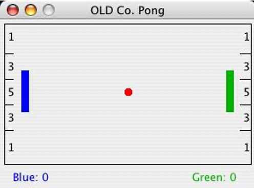
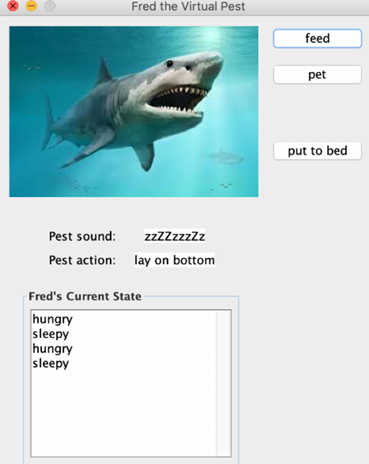
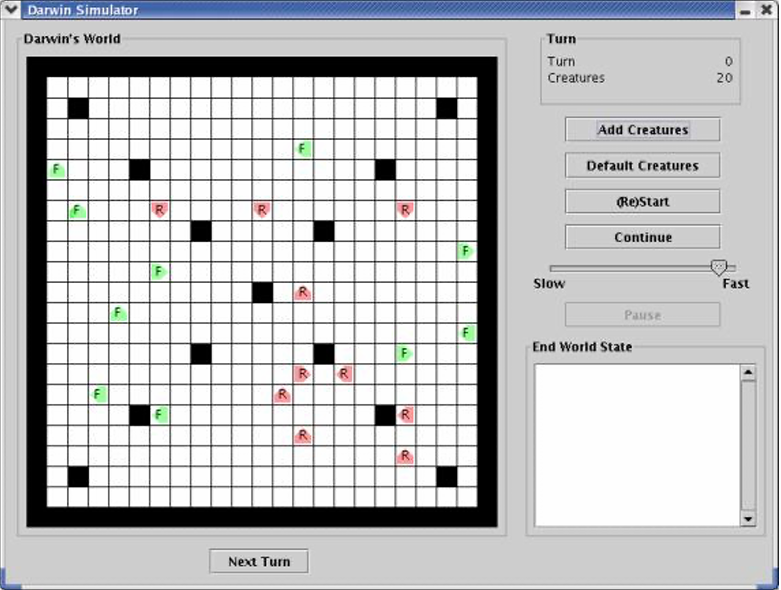
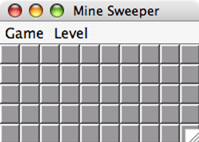
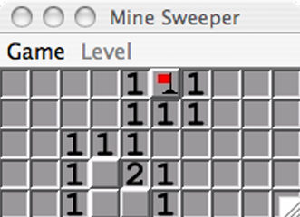
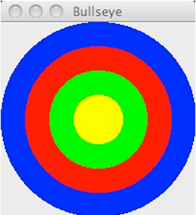
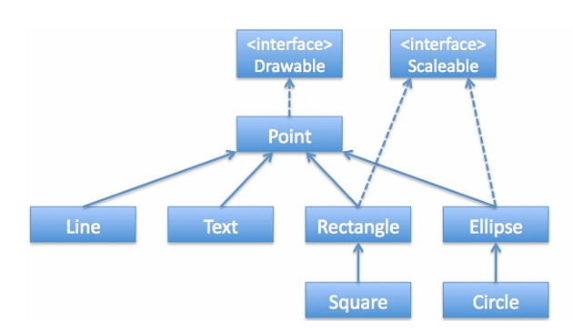
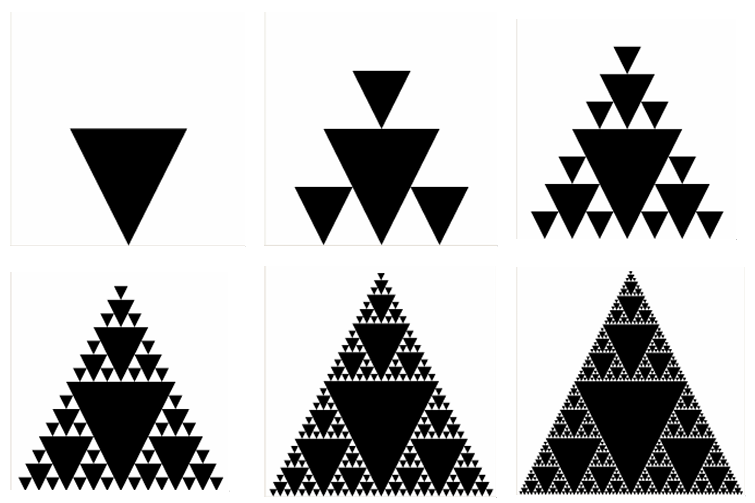

# Java_OOP_Whirlwind

A collection of challenges related to Object-Oriented Programming (OOP) in Java, Data Structures and Algorithms, Game Programming, and more.

# #1 – Pong Game

Welcome to the Pong Game project! This project is part of the Object-Oriented Programming Lab, and is designed to introduce fundamental concepts of object-oriented programming through the implementation of a classic Pong game.

---

# #2 – Virtual Pests

This project simulates a "virtual pet," or in this case, a "virtual pest," modeled as a finite state machine. You will be implementing the behaviors of a virtual pet, Fred the fish, and also designing your own custom virtual pet with distinct states and actions.

---

# #3 – Darwin's World

This project simulates Darwin's World, a game where creatures inhabit a 2D world, interact, and evolve based on programmed behaviors. Each creature belongs to a species, which defines its color and actions. The goal is to design and program creatures that can survive and spread their species by infecting others.

---

# #4 – MineSweeper Project

Game Start             |  Game Play
:-------------------------:|:-------------------------:
  |  

This project is part of a lab assignment for **COMP 132**. It involves developing a simplified version of the classic **Minesweeper** game using object-oriented programming principles. The game takes place on a grid where some cells contain hidden mines. The player’s goal is to uncover all cells without mines and to flag all the cells that contain mines.

---

# #5 - Drawable/Scaleable Shapes using Interfaces

This project is part of Lab 5, where we work with interfaces and polymorphism to create shapes that can be drawn and animated on the screen. The final product will be an application that draws a picture or performs animations using shapes.

---

# #6 – Using the Singleton and Adapter Design Patterns

This lab provides an opportunity to implement the Singleton and Adapter design patterns. Additionally, the lab introduces you to two Java features that we have not yet studied in detail:
1. The `enum` keyword, which allows you to define a new data type that enumerates several named options.
2. Reading data from a file using `BufferedReader`, `FileReader`, and `readLine()`.

These features will not be tested in exams or other homework, so you should be able to use them based on the provided example code without further background reading. It may also be helpful to reference the `designpatterns` folder from the class-examples repository.

---

# #7 – Drawable/Scaleable Shapes II, Using Inheritance

In the previous lab, you created several shapes that implemented the `Drawable` and `Scaleable` interfaces. You also implemented the `DrawableObjectList`, which was a collection of `Drawable` shapes. In this lab, you will use inheritance to implement a wider variety of shapes with less repetition of code. Specifically, you will implement and test classes named `Line`, `Text`, `Rectangle`, `Square`, `Ellipse`, and `Circle` that represent the corresponding objects.

---

# #8 – Recursion

In this lab, you will be developing recursive definitions for several problems and then implementing those recursive definitions as Java programs.

