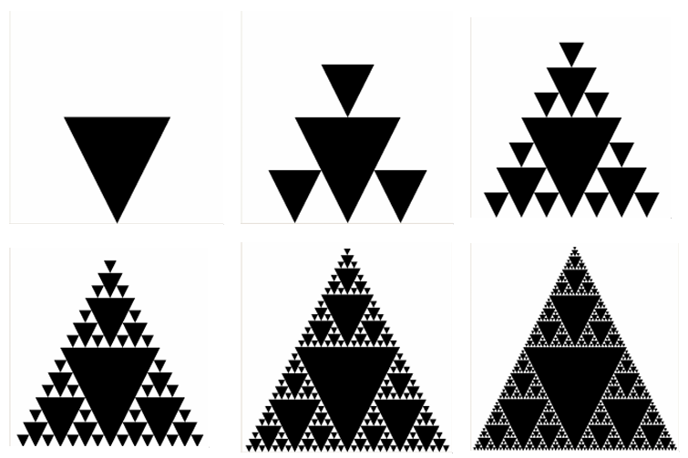

# Lab #8 – Recursion

## Introduction
In this lab, you will be developing recursive definitions for several problems and then implementing those recursive definitions as Java programs.

## Getting Started
Accept the assignment from GitHub Classroom, clone the `lab08-yourname` repository, and import the repository as a Java project. Expand the `recursion` package.

## The Assignment
Develop and implement and test a recursive solution to each of the problems described below. The `recursion` package contains a stub for each of the problems. You will complete the appropriate method(s) within the stub for each problem.

### 1. Pyramid Area
For this problem, you will write a method that computes the number of boxes in a pyramid of boxes based on the number of boxes in the base. The boxes in each layer of the pyramid are stacked directly on top of one another (i.e., not offset between two boxes below). For example, below are shown two pyramids, one with base 5 and one with base 6.

Implement and test the `computePyramidBoxes()` method in the `PyramidBoxCount` class. When testing the `computePyramidBoxes()` method, you should be sure to have at least one test method for each base case and at least one test method for each recursive case in your program.

### 2. Exponentiation
In the homework, you are asked to give a recursive definition for computing \(a^b\) (where both \(a\) and \(b\) are non-negative integer values). The most straightforward recursive definition for \(a^b\) is:

$$
a^b = 1, \quad \text{if } b = 0
$$
$$
a^b = a \times a^{b-1}, \quad \text{if } b > 0
$$

However, the value of \(a^b\) can be computed far more efficiently using the fact that if \(b\) is even then:

$$
a^b = (a^{b/2}) \times (a^{b/2})
$$

Implement and test the `exp` method in the `Exponentiation` class, using the more efficient approach just described above. (When \(b\) is odd, you will need to use a slight variant of the approach.) When testing the `exp` method, you should be sure to have at least one test method for each base case and at least one test method for each recursive case in your program. (This improved variant is sometimes called repeated squaring or exponentiation by squaring.)

### 3. Efficient Palindrome Checker
In class, we studied a recursive approach to determining whether a string is a palindrome. This code was in the `Recurse2.java` file, and it is provided to you again in the `Palindrome.java` file for this lab. The provided implementation is somewhat inefficient because it relies on calling the `substring()` method of the `String` class, and every call to `substring()` results in the creation of a new `String` object. In this lab, you must rewrite the `Palindrome.java` file so that no new `String` objects are created. Hints:

1. To obtain a single character from an existing string, use the `charAt()` method.
2. Use a recursive transformation on this problem to avoid creating new `String` objects.

- The required approach is similar to the way we transformed `countZs()` in class: pass in extra information as parameters to your recursive call, so that you can operate on the original string rather than creating new ones. See the file `EfficientCountZs.java` for details of this example.
- Usually, it is important not to change the method signature for any of the public methods provided to you in the starter code. But, for this question, you can and should change the signature of `isPalindrome()` — you will need to add some extra parameters, as we did in class when transforming `CountZs.java` to `EfficientCountZs.java`.
- However, as discussed in class, it is still beneficial to retain the original ‘interface’ of the method. While you need to modify the original method’s parameter list, you should also provide a method that retains the original method’s parameter list. You do not need to write tests for this method, only the recursive method that truly does the work.

When testing the `isPalindrome()` method, you should be sure to have at least one test method for each base case and at least one test method for each recursive case in your program.

### 4. Sierpinski Triangle
The Sierpinski triangle is an example of a fractal pattern. It was described by Polish mathematician Waclaw Sierpinski in 1915, but it has appeared in Italian art since the 13th century. Though the Sierpinski triangle looks complex, it can be generated with a short recursive program. The Sierpinski triangles of order 1, 2, 3, 4, 5, and 6 (respectively) are:

The recursive structure of the Sierpinski Triangle can be seen by looking at the order 3 triangle. In the order 3 triangle, there are 3 smaller order 2 Sierpinski Triangles arranged around an order 1 Sierpinski Triangle. Similarly, if we look at the order 4 Sierpinski Triangle, it has 3 smaller order 3 Sierpinski Triangles arranged around an order 1 Sierpinski Triangle. Also note that the triangles added for order 2 are half the size of the triangle of order 1. Similarly, the triangles added for order 3 are half the size of the triangles added for order 2, and so on.

Implement the `drawSierpinski()` method in the `SierpinskiPanel` class. To see your triangle, run the `main()` method in the `SierpinskiGUI` class, which will display a `JFrame` containing a `SierpinskiPanel` that draws an order 6 Sierpinski Triangle. You do not need to create a JUnit test for the `SierpinskiPanel` class.

**NOTE:** This problem is based on one developed by Prof. Tim Wahls.

## Submitting Your Solution
As usual, push your code to GitHub regularly for backup purposes and push your final version to submit the assignment. Additionally, as usual, submit your lab report to Gradescope via the link on Moodle. The lab report for this lab will consist only of the self-assessment report.