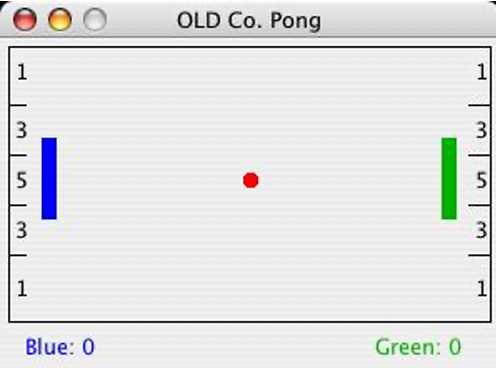

# Pong Game - Lab 01

Welcome to the Pong Game project! This project is part of the Object-Oriented Programming Lab, and is designed to introduce fundamental concepts of object-oriented programming through the implementation of a classic Pong game.

---

## Overview

Pong is a two-player game where each player controls a paddle and tries to prevent the ball from hitting the wall behind their paddle. Points are scored when the ball reaches the opponent’s wall, with higher points awarded the closer the ball hits to the center.

The project involves completing the implementation of three main classes to get the game functioning:

- **PongBall**: Handles the movement of the ball and its interactions.
- **PongPaddle**: Represents the paddles controlled by the players.
- **PongScore**: Keeps track of each player’s score.

---

## Project Structure

The project consists of 6 Java source files, but for this lab, the focus is on the following three classes:
- **PongBall.java**: You will implement the ball's behavior including movement and collision detection.
- **PongPaddle.java**: You will handle the paddle movement for both players.
- **PongScore.java**: You will manage the scoring system.

---

## Running the Game

To run the game:

1. Clone the repository and open it in Eclipse.
2. Run the main method in the `PongGame` class to launch the game.
3. Press the `B` key to start the ball's movement.
4. Use the following keys to control the paddles:
    - Left Paddle: 'A' (up), 'Z' (down)
    - Right Paddle: 'K' (up), 'M' (down)

---

## Example Game Screen

Here’s an example of what the game looks like when running:

---

## Authors

- @[annepham1512](https://github.com/annepham1512)

---
