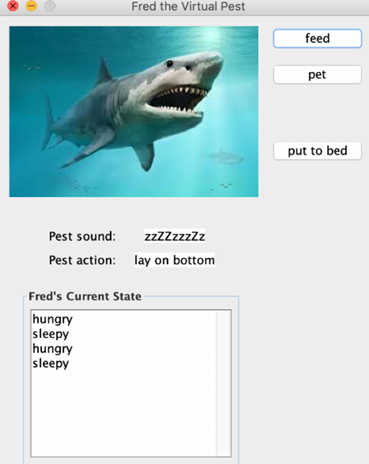

# Virtual Pests - Lab 02

This project simulates a "virtual pet," or in this case, a "virtual pest," modeled as a finite state machine. You will be implementing the behaviors of a virtual pet, Fred the fish, and also designing your own custom virtual pet with distinct states and actions.

---

## Overview

Virtual pets simulate real-life pet behaviors using states such as **hungry**, **sleepy**, **full**, or **grouchy**, which change based on interactions or the passage of time. Your task in this lab is to:

1. **Part A**: Implement Fred the fish's finite state machine based on given specifications.
2. **Part B**: Design and implement your own virtual pet with unique behaviors and states.

The state of Fred the fish (or your own pest) is updated by the owner's actions such as feeding, petting, or putting the pet to bed. The virtual pet will make sounds and perform actions depending on its state.

---

## Project Structure

The project is divided into two parts:

### Part A: Fred the Fish
- **VirtualPest.java**: Implements Fred's behavior based on a finite state machine with four states: hungry, sleepy, full, and grouchy.
- **VirtualPestGUI.java**: Provides the graphical interface for interacting with Fred.
- **JUnit Tests**: Test cases for Fred's behavior are provided in `VirtualPestTest.java`.

### Part B: Your Own Virtual Pest
- **OwnVirtualPest.java**: Implements your custom virtual pet with four new states and at least two new actions.
- **Custom GUI**: Design the graphical interface with your pet's image, sounds, and behaviors.
- **JUnit Tests**: Write your own tests for each method in the `OwnVirtualPest` class.

---

## Running the Game

To run the Virtual Pest simulation:

1. **Clone** the repository from GitHub and import it into Eclipse.
2. **Add JUnit5** library to the project to resolve any compilation errors in the test files.
3. Run the **VirtualPestGUI** class to start the simulation with Fred the fish.
4. **Interact** with Fred using the buttons (feed, pet, put to bed, etc.) and observe how his state changes based on your actions.

---

## Finite State Machine

Fred the fish's behavior is represented by a finite state machine with four states and transitions as described below:

Your custom pest should also have a finite state machine with at least 4 states and include random transitions.

---

## Authors

- @[annepham1512](https://github.com/annepham1512)

---

