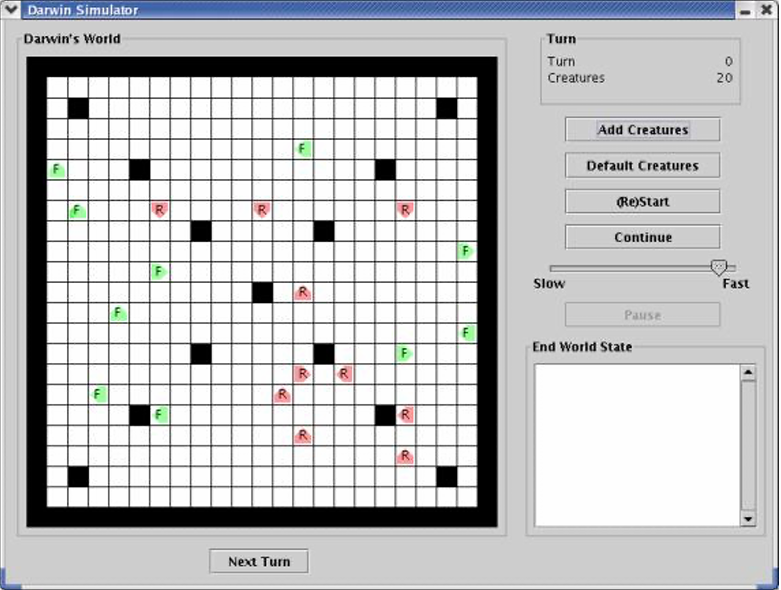

# Darwin's World - Lab 03

This project simulates Darwin's World, a game where creatures inhabit a 2D world, interact, and evolve based on programmed behaviors. Each creature belongs to a species, which defines its color and actions. The goal is to design and program creatures that can survive and spread their species by infecting others.

---

## Overview

Darwin's World is a grid-based simulation where creatures follow programs based on their species. The simulation proceeds in turns, where each creature executes its species-specific program, potentially moving, turning, or infecting other creatures. The aim is to evolve creatures to maximize the spread of your species.

Each creature:
- Lives in a grid square.
- Faces one of four directions (up, down, left, or right).
- Belongs to a species that defines its behavior and color.

### Sample World

---

## Project Structure

The project consists of several classes and files:

### Species Files
Each species has a text file containing:
- **Species Name**: e.g., Flytrap, Rover.
- **Color**: e.g., green, blue.
- **Program**: Instructions like `left`, `hop`, `infect`, which define the behavior of the species.

Pre-supplied species:
- **Flytrap**: Spins in place and infects enemies.
- **Rover**: Walks in straight lines, infects enemies in front.
- **Food**: Moves in a square, serves as food for other creatures.
- **Hop**: Continuously hops forward until blocked.

### Creature Behavior

Each creature follows a program consisting of steps that define its behavior. The possible instructions include:
- **hop**: Move forward if the square ahead is empty.
- **left / right**: Turn 90 degrees left or right.
- **infect**: Infect the creature ahead (if it's an enemy).
- **conditional instructions**: `ifwall`, `ifempty`, `ifsame`, `ifenemy`, and more, which make the creature act based on conditions.

Programs are written in species text files, and the game executes these behaviors turn by turn.

### User Interface

The GUI allows users to:
- **Add Creatures**: Add creatures to the world using species files.
- **Start Simulation**: Begin a simulation or restart it.
- **Next Turn**: Process one turn for each creature.
- **Continue**: Run the simulation automatically until the maximum number of turns is reached (200 turns).

---

## Tasks

1. **Program Class**: Complete the `Program` class which handles the execution of species programs. Write test cases to achieve full statement coverage.
   
2. **Creature Class**: Implement the `Creature` class that models the individual creatures in the world. Write test cases to ensure full coverage of all methods.

3. **Design Your Own Creature**:
   - Create a species file for your custom creature.
   - Define at least 4 instructions in the program, and use all instruction types (e.g., `ifempty`, `ifenemy`, `go`).
   - Name your creature file `MyCreature.txt` and place it in the `src` directory.

4. **Lab Report**: Write a report detailing your experience, challenges, and testing outcomes. Include:
   - Self-evaluation of the assignment.
   - Explanation of how to add a new instruction to the creature programs.
   - Investigation of any errors in the simulation (e.g., not getting the correct number of creatures).

---

## Testing

- Implement unit tests for both the `Program` and `Creature` classes to ensure that all methods are covered and function correctly.
- Ensure statement coverage for all implemented methods.
- Manually verify the print method for correctness.

---

## How to Run

1. **Clone** the repository and import it into Eclipse.
2. Add the provided species files (`Flytrap.txt`, `Rover.txt`, `Food.txt`, etc.) to the `src` directory.
3. Run the `DarwinGUI.java` class to start the simulation.
4. Use the GUI to add creatures and run the simulation.
5. Observe how creatures interact and evolve as the simulation progresses.

---

## Custom Creatures

You can create your own creatures by creating new text files in the format described above. Follow these steps:
1. Define the species name and color.
2. Write the program instructions for your species.
3. Add your creature to the simulation through the GUI or by editing the `DCRITTERS` field in `DarwinGUI.java`.

---

## Submission Instructions

1. **Push** your code and creatures to GitHub.
2. **Submit** your lab report on Gradescope, including:
   - Self-assessment.
   - Your custom creature files.
   - Test cases and results.
   - Discussion of potential improvements or errors in the simulation.
   
---

## Authors

- @[annepham1512](https://github.com/annepham1512)

---
