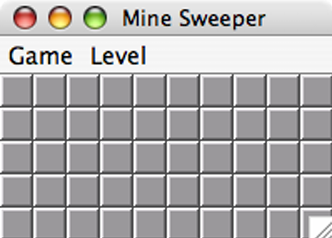

# MineSweeper Project - Lab 4

Game Start             |  Game Play
:-------------------------:|:-------------------------:
  |  

## Overview

This project is part of a lab assignment for **COMP 132**. It involves developing a simplified version of the classic **Minesweeper** game using object-oriented programming principles. The game takes place on a grid where some cells contain hidden mines. The player’s goal is to uncover all cells without mines and to flag all the cells that contain mines.

## Game Rules

1. **Uncovering Cells**: 
   - Left-clicking on a cell uncovers it. If the uncovered cell contains a mine, the game is over. 
   - If the cell does not contain a mine, it will display either a blank (if no adjacent cells contain mines) or a number representing how many neighboring cells contain mines.
   
2. **Flagging Cells**: 
   - Right-clicking a cell flags it, indicating that you suspect it contains a mine. 
   - Right-clicking a flagged cell again removes the flag.
   
3. **Winning and Losing**: 
   - The game ends when you uncover a mine (lose) or uncover all safe cells and flag all mine cells (win).

## Project Structure

### Files and Directories

- `src/` : Contains the source code.
  - `MineSweeper.java`: Main class to run the Minesweeper game.
  - `MineSweeperBoard.java`: Critical class responsible for managing the game board, including mine placement, flagging, and uncovering cells.
  
- `tests/`: Contains JUnit test cases.
  - Test cases are used to validate various aspects of the `MineSweeperBoard` class.

### Constants Used in the Game

The board state is represented using the following constants:

| Value | Constant        | Description                                                            |
|-------|-----------------|------------------------------------------------------------------------|
| -1    | `COVERED_CELL`  | A cell that has not yet been uncovered.                                |
| -2    | `MINE`          | A cell containing a mine that has not been uncovered or flagged.        |
| -3    | `FLAG`          | A cell that does not contain a mine but has been incorrectly flagged.   |
| -4    | `FLAGGED_MINE`  | A cell that contains a mine and has been correctly flagged.             |
| -5    | `UNCOVERED_MINE`| A cell containing a mine that has been uncovered (game over).           |
| 0-8   | N/A             | A cell that has been uncovered and contains a number representing the number of adjacent mines. |

## How to Run

### Prerequisites

- **Java Development Kit (JDK)** installed.
- **Eclipse IDE** or another Java-compatible IDE.

### Steps

1. **Clone the repository**:
   ```bash
   git clone https://github.com/your-username/lab04-minesweeper

2. **Open the Project**: 
    - Open the cloned project in Eclipse or another preferred IDE.

3. **Run the Game**:
    - Navigate to the MineSweeper.java file and run the main method.
    - The game window should appear, but note that it will not be fully functional until you implement the MineSweeperBoard class.

---

## Authors

- @[annepham1512](https://github.com/annepham1512)

---