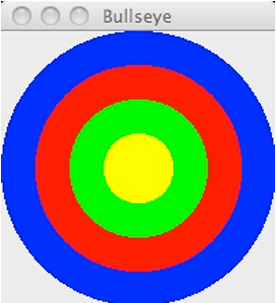

# Drawable/Scaleable Shapes using Interfaces

## Introduction
This project is part of Lab 5, where we work with interfaces and polymorphism to create shapes that can be drawn and animated on the screen. The final product will be an application that draws a picture or performs animations using shapes.

## Overview
The project revolves around two interfaces: `Drawable` and `Scaleable`. These interfaces allow various shapes to be handled uniformly, whether it's a circle, rectangle, or line. The lab also provides a class `DrawableObjectList`, which manages collections of `Drawable` objects and allows operations like drawing and scaling all objects.

Key interfaces and components:
- **Drawable Interface**: Methods for drawing, setting color, and visibility.
- **Scaleable Interface**: A method for scaling objects by a factor.

The project will involve creating new classes that implement these interfaces and testing them thoroughly before building a final animated or static image.

## Project Structure
The project is structured as follows:
- `DrawableObjectList`: Manages a collection of `Drawable` objects.
- `Circle` class: A sample class that implements both `Drawable` and `Scaleable`.
- Custom shape classes: Additional shapes that implement `Drawable` and/or `Scaleable`.
- Example programs like `Bullseye` and `Annihilation` demonstrate drawing and animation.

## How to Run
1. Clone the repository from GitHub Classroom.
2. Import the project into Eclipse.
3. Ensure JUnit5 is added to the build path to run the tests.
4. Compile and run the sample programs like `Bullseye` or create your own drawing using the provided `Drawable` and `Scaleable` classes.

## Example Game Screen

Here’s an example of what the game looks like when running:

---
## Authors

- @[annepham1512](https://github.com/annepham1512)

---